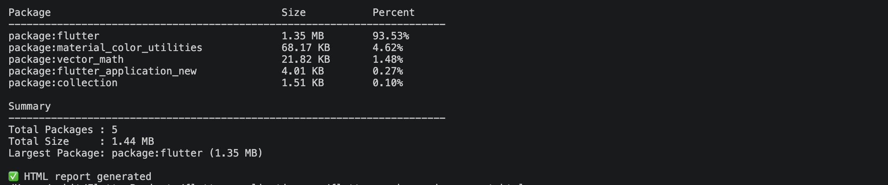
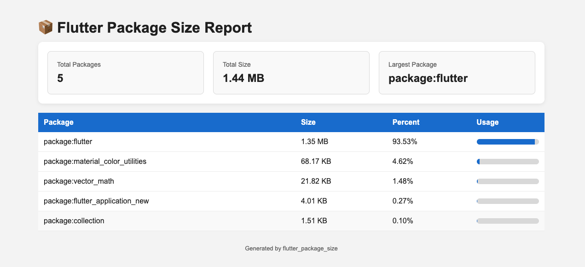

<!-- # flutter_package_size

> 📦 Analyze the size contribution of each Dart package in your Flutter APK.

`flutter_package_size` is a lightweight CLI that automates Flutter's `--analyze-size` workflow and generates clean terminal output, JSON, CSV, and HTML reports.

---

## ✨ Features

- 📦 Analyze package-level Dart AOT size
- 📊 Percentage contribution of every package
- 📈 Summary with total size and largest package
- 📄 Export JSON report
- 📑 Export CSV report
- 🌐 Beautiful HTML report
- 🤖 GitHub Actions ready
- ⚡ Simple CLI
- 🎯 Show Top N largest packages

---

# Screenshots

## Terminal Output

<p align="center">
  
</p>

---

## HTML Report

<p align="center">
  
</p>

---

## Installation

Activate globally

```bash
dart pub global activate flutter_package_size
```

or add it as a dev dependency

```yaml
dev_dependencies:
  flutter_package_size: latest
```

---

## Requirements

- Flutter SDK
- Dart SDK
- Android SDK
- A Flutter project

---

## Usage

Run inside the root of your Flutter project.

### Analyze package sizes

```bash
flutter_package_size analyze
```

### Show only Top 10 packages

```bash
flutter_package_size analyze --top 10
```

### Generate JSON report

```bash
flutter_package_size analyze --json
```

### Generate CSV report

```bash
flutter_package_size analyze --csv
```

### Generate HTML report

```bash
flutter_package_size analyze --html
```

### Generate all reports

```bash
flutter_package_size analyze --json --csv --html
```

---

## Sample Output

```text
Package                                      Size           Percent
------------------------------------------------------------------------
package:flutter                              1.35 MB        93.53%
package:material_color_utilities             68.17 KB       4.62%
package:vector_math                          21.82 KB       1.48%
package:flutter_application                  4.01 KB        0.27%
package:collection                           1.51 KB        0.10%

Summary
------------------------------------------------------------------------
Total Packages : 5
Total Size     : 1.44 MB
Largest Package: package:flutter (1.35 MB)
```

---

# Generated Reports

### JSON

```
flutter_package_size_report.json
```

Contains structured package information suitable for automation, CI/CD, and custom tooling.

---

### CSV

```
flutter_package_size_report.csv
```

Can be opened in Excel, Google Sheets, or LibreOffice.

---

### HTML

```
flutter_package_size_report.html
```

A beautiful browser report containing:

- Summary cards
- Package breakdown
- Percentage bars
- Responsive layout

---

## Command Options

| Option | Description |
|---------|-------------|
| `--json` | Generate JSON report |
| `--csv` | Generate CSV report |
| `--html` | Generate HTML report |
| `--top` | Show Top N packages |

---

## GitHub Actions

Automatically generate reports during CI.

```yaml
name: Flutter Package Size

on:
  pull_request:

jobs:
  analyze:
    runs-on: ubuntu-latest

    steps:
      - uses: actions/checkout@v4

      - uses: subosito/flutter-action@v2
        with:
          channel: stable

      - run: flutter pub get

      - run: dart run flutter_package_size:flutter_package_size analyze --json --csv --html
```

---

## Why flutter_package_size?

Flutter already provides `flutter build apk --analyze-size`, but the output is primarily intended for Flutter DevTools.

`flutter_package_size` simplifies the process by:

- Automatically building the APK
- Locating the generated analysis JSON
- Parsing Dart AOT package sizes
- Calculating package percentages
- Producing clean terminal output
- Exporting JSON, CSV, and HTML reports
- Integrating easily with GitHub Actions

---

## Roadmap

- ✅ JSON export
- ✅ CSV export
- ✅ HTML report
- 🔄 Markdown report
- 🔄 Package comparison
- 🔄 Searchable HTML report
- 🔄 Dark mode
- 🔄 GitHub PR comments
- 🔄 Size budget enforcement (`--fail-above`)

---

## Contributing

Contributions, feature requests, and bug reports are welcome.

Feel free to open an issue or submit a pull request.

---

## License

MIT License -->

# flutter_package_size

> 📦 Analyze the size contribution of each Dart package in your Flutter APK.

`flutter_package_size` is a lightweight CLI that automates Flutter's `--analyze-size` workflow and generates clean terminal output, JSON, CSV, and HTML reports.

---

## ✨ Features

- 📦 Analyze package-level Dart AOT size
- 📊 Percentage contribution of every package
- 📈 Summary with total size and largest package
- 📄 Export JSON report
- 📑 Export CSV report
- 🌐 Beautiful HTML report
- 🎯 Show Top N largest packages
- 🤖 GitHub Actions ready
- ⚡ Simple CLI
- 🚀 CI/CD friendly

---

## 📸 Screenshots

### Terminal Output

<p align="center">
  
</p>

---

### HTML Report

<p align="center">
  
</p>

---

## 📦 Installation

### Activate globally

```bash
dart pub global activate flutter_package_size
```

### Or add as a dev dependency

```yaml
dev_dependencies:
  flutter_package_size: latest
```

---

## ⚙️ Verify Installation

```bash
flutter_package_size --version
```

If the command is not found, add Dart's global binaries to your `PATH`:

```bash
export PATH="$PATH:$HOME/.pub-cache/bin"
```

---

## ⚙️ Requirements

- Flutter SDK
- Dart SDK
- Android SDK
- A Flutter project

---

## 🚀 Usage

Run the commands from the root of your Flutter project.

### 📦 Analyze package sizes

```bash
flutter_package_size analyze
```

### 🎯 Show Top N packages

```bash
flutter_package_size analyze --top 10
```

### 📄 Generate JSON report

```bash
flutter_package_size analyze --json
```

### 📑 Generate CSV report

```bash
flutter_package_size analyze --csv
```

### 🌐 Generate HTML report

```bash
flutter_package_size analyze --html
```

### 🚀 Generate all reports

```bash
flutter_package_size analyze --json --csv --html
```

---

## 📊 Sample Output

```text
Package                                      Size           Percent
------------------------------------------------------------------------
package:flutter                              1.35 MB        93.53%
package:material_color_utilities             68.17 KB       4.62%
package:vector_math                          21.82 KB       1.48%
package:flutter_application                  4.01 KB        0.27%
package:collection                           1.51 KB        0.10%

Summary
------------------------------------------------------------------------
Total Packages : 5
Total Size     : 1.44 MB
Largest Package: package:flutter (1.35 MB)
```

---

## 📁 Generated Reports

### 📄 JSON Report

```
flutter_package_size_report.json
```

Machine-readable output suitable for:

- CI/CD pipelines
- Automation
- Custom tooling
- Integrations

---

### 📑 CSV Report

```
flutter_package_size_report.csv
```

Can be opened in:

- Microsoft Excel
- Google Sheets
- LibreOffice Calc
- BI & analytics tools

---

### 🌐 HTML Report

```
flutter_package_size_report.html
```

A beautiful browser report containing:

- 📊 Summary cards
- 📦 Package breakdown
- 📈 Percentage bars
- 📱 Responsive layout

---

## ⚙️ Command Options

| Option | Description |
|---------|-------------|
| `--json` | Generate JSON report |
| `--csv` | Generate CSV report |
| `--html` | Generate HTML report |
| `--top` | Show Top N packages |

---

## 🤖 GitHub Actions

Automatically generate reports during CI.

```yaml
name: Flutter Package Size

on:
  pull_request:

jobs:
  analyze:
    runs-on: ubuntu-latest

    steps:
      - uses: actions/checkout@v4

      - uses: subosito/flutter-action@v2
        with:
          channel: stable

      - run: flutter pub get

      - run: dart run flutter_package_size:flutter_package_size analyze --json --csv --html
```

---

## 🧠 Why flutter_package_size?

Flutter already provides:

```bash
flutter build apk --analyze-size
```

However, the generated output is primarily intended for Flutter DevTools and isn't easy to inspect directly.

`flutter_package_size` simplifies the workflow by:

- ✅ Automatically running Flutter size analysis
- ✅ Extracting Dart AOT package breakdown
- ✅ Calculating package size percentages
- ✅ Producing clean terminal output
- ✅ Exporting JSON, CSV, and HTML reports
- ✅ Integrating seamlessly with CI/CD pipelines

---

## 🚀 First Release (v0.1.0)

The initial release includes:

- Core APK size analysis
- Clean CLI experience
- JSON report generation
- CSV report generation
- HTML report generation
- Top package filtering
- GitHub Actions support

---

## 🔮 Roadmap

- ✅ JSON export
- ✅ CSV export
- ✅ HTML report
- 🔄 Markdown report
- 🔄 Package comparison
- 🔄 Searchable HTML report
- 🔄 Dark mode
- 🔄 GitHub PR comments
- 🔄 Size budget enforcement (`--fail-above`)
- 🔄 Performance improvements

---

## 📦 Install from pub.dev

```bash
dart pub add flutter_package_size
```

or

```bash
dart pub global activate flutter_package_size
```

---

## 🤝 Contributing

Contributions are welcome!

You can help by:

- 🐞 Reporting bugs
- 💡 Suggesting new features
- 📝 Improving documentation
- 🔧 Submitting pull requests

Feel free to open an issue or create a pull request.

---

## 📄 License

MIT License
